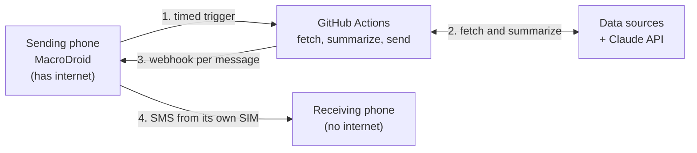

# Daily Brief Bot

A daily briefing delivered over SMS. It fetches a few categories of information,
summarizes each one with the Claude API, and sends them as plain text messages —
so the brief still arrives on a phone that has no internet connection.

There is no server and no SMS provider. GitHub Actions runs the pipeline, and an
Android phone running [MacroDroid](https://www.macrodroid.com/) sends the
messages from its own SIM.

The project is also an experiment in **spec-driven, AI-assisted development**:
nearly all of the code was written by an AI agent working to a written
specification rather than to conversation. See [Development Approach](#development-approach).

## Why This Exists

Some situations cut you off from the internet for a stretch of time — military
service, a hospital stay, fieldwork, a place with no coverage. The connection
goes, the browser goes, often the phone goes with them. What usually survives is
an SMS inbox.

This is built for that: to keep following the few things you follow every day,
when the way you normally follow them is gone.

That constraint explains the design. SMS rather than an app or an email, because
SMS is the channel that still arrives. One message per category, because a
message that arrives half-read is worse than several that each stand alone.
Summaries rather than links, because a link cannot be opened. Every decision of
this kind is recorded under [`docs/adr/`](./docs/adr/).

## How It Works



The phone appears at both ends because it is the only part of the chain that can
reach someone offline: it starts the run, and it delivers the result. The two
phones are one device if you run this for yourself, and two devices if the
reader is the one without a connection.

Each category is fetched and summarized independently, so a failing data source
costs that one category an `[unavailable: ...]` line and nothing more.

[`docs/architecture.md`](./docs/architecture.md) has the same picture with the
modules filled in.

## What It Sends

| Category | Source | Summarized |
|---|---|---|
| Market news | Finnhub | yes |
| Portfolio | yfinance, symbols from a local config file | yes |
| General news | RSS feeds | yes |
| Sports | football-data.org | yes |
| Vocabulary | a local plain-text word list | no — sent as written |

Categories are independent modules under `src/app/fetchers/`; adding or removing
one is a local change. The vocabulary category skips the model on purpose: the
entries are already short, so summarizing them would only lose information.

## Development Approach

Two things are worth separating, because both involve AI and they are unrelated.
**At runtime**, Claude is one component among several: it summarizes text, and
nothing else. **During development**, an AI agent wrote nearly all of the code.
This section is about the second.

### Spec-driven development

The specification exists before the code, lives in the repository, and is what
the agent reads before making any change.

| File | Holds |
|---|---|
| [`AGENTS.md`](./AGENTS.md) | binding rules — coding, testing, secrets, git, and the task loop |
| [`PLAN.md`](./PLAN.md) | architecture and delivery phases |
| [`TASKS.md`](./TASKS.md) | the backlog, worked in order |
| [`docs/adr/`](./docs/adr/) | decision records, including the options that were rejected |

[`CLAUDE.md`](./CLAUDE.md) contains no rules of its own; it only points at
`AGENTS.md`. Two copies of a specification eventually disagree, and rules that
contradict each other are worse than no rules.

### The task loop

Every task follows the same cycle: explore → plan → implement → test → static
checks (`ruff`, `mypy`) → self-review the diff → update `TASKS.md` → commit. One
task per branch, merged with `--no-ff`, and nothing new starts until the current
task is finished.

The effect is that `git log` becomes the project record. Each task is a single
merge, and the commit message underneath explains *why* the change was made —
the diff already shows what changed.

### Guardrails, not good intentions

An agent generating code at speed will eventually forget a rule, so the rules are
enforced by machinery rather than by discipline:

- `tests/conftest.py` removes every real credential and blocks outbound network
  connections before each test. A test that forgets to mock cannot quietly spend
  live API quota or send a real message — it fails instead.
- The same file reads `config.py` with Python's `ast` module to discover which
  secrets exist, so the list is derived from the code rather than maintained by
  hand.
- `mypy --strict`, `ruff`, a coverage floor and `detect-secrets` run in CI and as
  pre-commit hooks.
- Error isolation between categories is a stated rule, not an implementation
  detail, and is tested as such.

### Decisions are measured, and reversals are kept

Where a design choice turned out to be wrong, the correction and its reasoning
stay in the repository instead of being tidied away. The scheduler is the clearest
example: the original plan used a cloud function, which became GitHub Actions
([`0007`](./docs/adr/0007-github-actions-over-aws-lambda.md)), whose own estimate
of scheduling accuracy was then contradicted by measurement — so the schedule was
removed entirely and the trigger moved to the phone.

Keeping that history is deliberate. The reasoning is the expensive part to
rediscover, and an agent reading `TASKS.md` later needs to know which
obvious-looking approach has already been tried.

## Tech Stack

Python 3.12 · Anthropic Claude API · yfinance, feedparser, requests · pytest ·
ruff · mypy (strict) · pre-commit · GitHub Actions · MacroDroid

## Quick Start

```bash
python -m venv .venv
source .venv/bin/activate
pip install -e ".[dev]"
pre-commit install
cp config/portfolio.example.json config/portfolio.json   # then edit the symbols
cp data/vocabulary.example.txt data/vocabulary.txt       # then add your own entries
```

Both copies are gitignored: they hold personal data, and in deployment they
reach the runner as repository secrets rather than through the checkout. The
`.example` files exist to show the format.

Create a gitignored `.env` in the repository root. `src/app/config.py` is the
only module that reads it.

| Variable | Needed for |
|---|---|
| `ANTHROPIC_API_KEY` | summarization |
| `FINNHUB_API_KEY` | market news |
| `FOOTBALL_DATA_API_KEY` | sports — free key from football-data.org |
| `MACRODROID_TRIGGER_URL` | SMS delivery; produced during [deployment](./docs/deployment.md) |

Then run it:

```bash
python -m app.main --dry-run   # build the briefing and print it, send nothing
python -m app.main             # print it and send one SMS per category
pytest && ruff check . && mypy src
```

`--dry-run` needs no `MACRODROID_TRIGGER_URL`. Sending is the default because the
scheduled run passes no arguments.

The briefing goes to stdout and the run log to stderr, so the deployed workflow
can keep only the log:

```
INFO MARKETS ok in 2.4s, 312 chars.
INFO PORTFOLIO ok in 3.1s, 590 chars.
INFO NEWS ok in 2.8s, 401 chars.
INFO SPORTS ok in 1.9s, 288 chars.
INFO VOCAB ok in 0.0s, 15 words over 3 messages.
INFO SMS relay accepted all 7 categories.
```

## Deployment

The full walkthrough is in [`docs/deployment.md`](./docs/deployment.md): the
MacroDroid macro that sends the SMS, the GitHub Actions workflow and its secrets,
and the timed trigger that starts the run.

Two things there are worth knowing before you begin. The workflow deliberately has
**no cron** — GitHub queues scheduled runs and drains the queue when it suits,
which made delivery hours late, so the phone triggers the run through
`workflow_dispatch` instead. And a webhook that answers `ok` only means the
message was *queued*; nothing in this project can observe the final SMS hop.

## Documentation

| File | Contents |
|---|---|
| [`AGENTS.md`](./AGENTS.md) | rules any coding agent must follow in this repo |
| [`PLAN.md`](./PLAN.md) | architecture and phases |
| [`TASKS.md`](./TASKS.md) | task backlog and the reasoning behind each item |
| [`docs/architecture.md`](./docs/architecture.md) | system design diagrams, module responsibilities |
| [`docs/data-sources.md`](./docs/data-sources.md) | APIs used and their rate limits |
| [`docs/deployment.md`](./docs/deployment.md) | end-to-end deployment |
| [`docs/adr/`](./docs/adr/) | architecture decision records |

## Working On This Repository With An AI Agent

Open the repository in an agent-capable editor and start with:

> Read CLAUDE.md and AGENTS.md in full before doing anything else. Then read
> PLAN.md and TASKS.md to understand the project.
>
> Take the next unchecked task in TASKS.md and follow the Agent Loop defined in
> AGENTS.md exactly: explore, plan, implement, test, run static checks,
> self-review, update TASKS.md — then show me the diff before committing.
>
> Do not skip ahead to later tasks. Read the ADRs under docs/adr/ before
> proposing anything about SMS delivery or deployment; several obvious-looking
> options were tried and rejected there for reasons that are not visible from the
> code.

If the brief is running in production, treat changes to `sender.py`,
`sms_text.py` or `daily-brief.yml` as changes to something live: the only
end-to-end proof is a manual dispatch after the change is on `main`.
