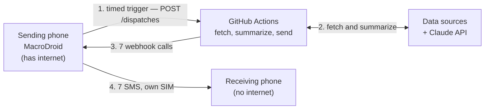
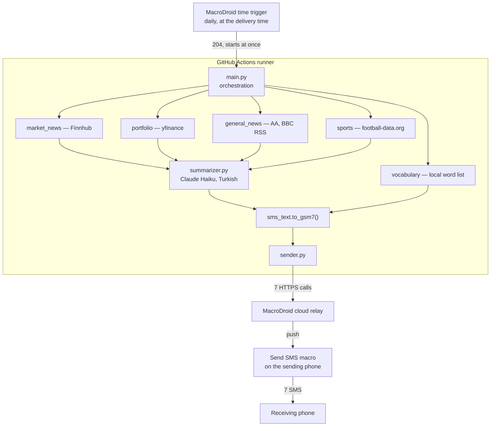

# Architecture Detail

## System Design
Four moving parts. The one worth looking at twice is that the phone appears at
both ends: it starts the run, and it is also what delivers the result.

There is no server anywhere in that picture, and nothing in it runs on the
reader's side. Step 1 is a *request* rather than a scheduled job, which is the
whole reason the brief arrives on time — see
[`0007`](./adr/0007-github-actions-over-aws-lambda.md).

The two phones are one device if you run this for yourself, and two devices if
the reader is the one without a connection — in which case the sending phone
holds both macros. The messages arrive in a fixed order: markets, portfolio,
news, sports, then the vocabulary parts. See
[`deployment.md`](./deployment.md#when-the-phone-belongs-to-someone-else).

## Inside One Run
About a minute, start to finish.

Two things the arrows are hiding:

- **Each of the five branches is its own try/except.** A dead API costs that
  category an `[unavailable: ...]` line and nothing else — the other four still
  arrive. This is a rule, not an accident (`AGENTS.md`, coding rule 4).
- **The arrow into the relay is where certainty ends.** The relay answers
  `200 ok` as soon as it has queued a push, and answers identically when the
  phone is off or out of SMS credit. That is why `sender.py` reports `accepted`
  and never `delivered`, and why the brief arriving is the only real proof
  ([`0006`](./adr/0006-macrodroid-over-twilio.md)).

Vocabulary is the one branch that skips the summarizer: the entries are already
short, so a paraphrase would lose information rather than save space
(`PLAN.md` §4). It is also a single failure boundary for its three messages, so a
missing word list costs one `[unavailable: ...]` rather than three.

## Module Responsibilities
| Module | Responsibility | External dependency | Phase |
|---|---|---|---|
| `config.py` | read env vars, single entry point | none | 1 |
| `fetchers/portfolio.py` | symbol price/change data | yfinance | 1 |
| `fetchers/market_news.py` | global market headlines | Finnhub | 1 |
| `fetchers/general_news.py` | TR + global news | RSS (AA Gündem/Ekonomi, BBC World) | 1 |
| `fetchers/sports.py` | football league results | football-data.org | 1 |
| `fetchers/vocabulary.py` | parse the word list, pick the day's entries, split them into messages | `data/vocabulary.txt` (local file, no API) | 4 |
| `summarizer.py` | turn raw data into a short Turkish summary | Anthropic Claude API | 1 |
| `sms_text.py` | fold Turkish letters into GSM-7 so a segment holds 153 chars, not 67 | none | 2 |
| `main.py` | orchestration, error isolation, terminal output, `--dry-run`, exit code | all of the above | 1–2 |
| `sender.py` | SMS delivery | MacroDroid webhook (the sending phone — not necessarily the reader's) | 2 |

There is no `lambda_handler.py` row: `adr/0007` replaced the cloud-function plan with a GitHub Actions workflow, which runs `main.py` directly.

## Data Flow (Single Category)
1. `main.py` calls the relevant fetcher → returns raw data (dict/list)
2. Raw data goes to `summarizer.py` with a category-specific prompt
3. Claude API returns a short summary
4. `main.py` prints the summary under that category's heading
5. If any step fails, that category prints `[unavailable: <reason>]`; the others are unaffected

The vocabulary skips steps 2 and 3: `main.py` calls `daily_messages()`, which
reads the word list, selects the day's entries by date arithmetic and renders
them, and the result goes straight to step 4 as numbered sections.
