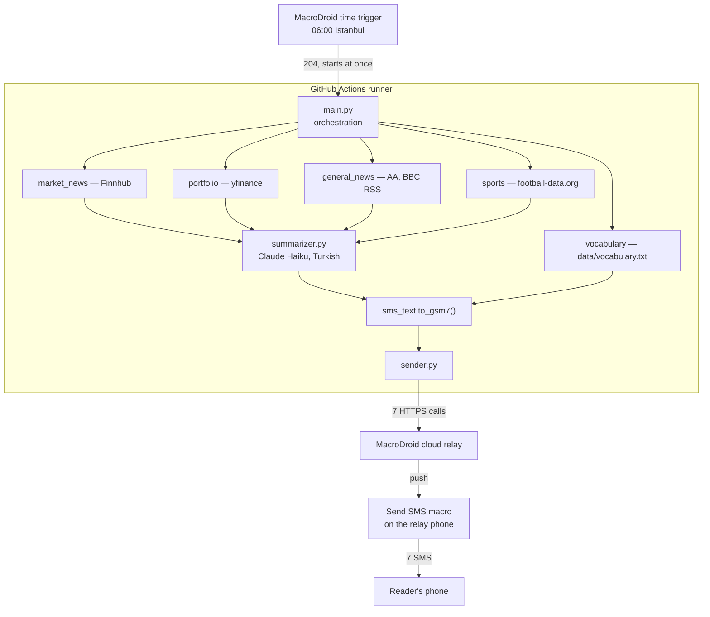

# Architecture Detail

## System Design
Four moving parts. The one worth looking at twice is that the phone appears at
both ends: it starts the run, and it is also what delivers the result.


There is no server anywhere in that picture, and nothing in it runs on the
reader's side. Step 1 is a *request* rather than a scheduled job, which is the
whole reason the brief arrives at 06:00 — see
[`0007`](./adr/0007-github-actions-over-aws-lambda.md).

The two phones are one device when you run this for yourself, and **two devices
in the deployed setup**: the reader has no internet, so the relay is a friend's
phone holding both macros. The seven messages arrive in a fixed order — markets,
portfolio, news, sports, then vocabulary 1/3 to 3/3. See README "When the phone
belongs to someone else".

## Inside One Run
About a minute, start to finish.



Two things the arrows are hiding:

- **Each of the five branches is its own try/except.** A dead API costs that
  category an `[unavailable: ...]` line and nothing else — the other four still
  arrive. This is a rule, not an accident (`AGENTS.md`, coding rule 4).
- **The arrow into the relay is where certainty ends.** The relay answers
  `200 ok` as soon as it has queued a push, and answers identically when the
  phone is off or out of SMS credit. That is why `sender.py` reports `accepted`
  and never `delivered`, and why the brief arriving is the only real proof
  ([`0006`](./adr/0006-macrodroid-over-twilio.md)).

Vocabulary is the one branch that skips the summarizer: the entries are personal
study notes, so there is nothing to condense and a paraphrase would be a loss
(`PLAN.md` §4). It is also one failure boundary for three messages, so a missing
notebook costs one `[unavailable: ...]` rather than three.

## Phase 1 Component Diagram
```
CLI (python -m app.main)
        |
        +--> fetchers/portfolio.py    --> summarizer.py --> print (Portfolio section)
        +--> fetchers/market_news.py  --> summarizer.py --> print (Markets section)
        +--> fetchers/general_news.py --> summarizer.py --> print (News section)
        +--> fetchers/sports.py       --> summarizer.py --> print (Sports section)
        +--> fetchers/vocabulary.py   -------------------> print (Vocab 1/3..3/3)
```
Each row runs in its own try/except block; `main.py` collects the results and prints them together.

The vocabulary row is short one arrow on purpose: it never reaches the
summarizer. The entries are the owner's own study notes, so there is nothing to
condense and a paraphrase would be a loss — see `PLAN.md` §4. It is also the one
row that produces several sections from a single failure boundary, so a missing
notebook costs one `[unavailable: ...]` rather than three.

## Module Responsibilities
| Module | Responsibility | External dependency | Phase |
|---|---|---|---|
| `config.py` | read env vars, single entry point | none | 1 |
| `fetchers/portfolio.py` | symbol price/change data | yfinance | 1 |
| `fetchers/market_news.py` | global market headlines | Finnhub | 1 |
| `fetchers/general_news.py` | TR + global news | RSS (AA Gündem/Ekonomi, BBC World) | 1 |
| `fetchers/sports.py` | football league results | football-data.org | 1 |
| `fetchers/vocabulary.py` | parse the notebook, pick the day's 15 entries, split them into messages | `data/vocabulary.txt` (in-repo, no API) | 4 |
| `summarizer.py` | turn raw data into a short Turkish summary | Anthropic Claude API | 1 |
| `sms_text.py` | fold Turkish letters into GSM-7 so a segment holds 153 chars, not 67 | none | 2 |
| `main.py` | orchestration, error isolation, terminal output, `--dry-run`, exit code | all of the above | 1–2 |
| `sender.py` | SMS delivery | MacroDroid webhook (the relay phone — not necessarily the reader's) | 2 |

There is no `lambda_handler.py` row any more: `docs/adr/0007` replaced Lambda with a scheduled GitHub Actions workflow, which runs `main.py` directly.

## Data Flow (Single Category, Phase 1)
1. `main.py` calls the relevant fetcher → returns raw data (dict/list)
2. Raw data goes to `summarizer.py` with a category-specific prompt
3. Claude API returns a short summary
4. `main.py` prints the summary under that category's heading
5. If any step fails, that category prints `[unavailable: <reason>]`; the others are unaffected

The vocabulary skips steps 2 and 3: `main.py` calls `daily_messages()`, which
reads the notebook, selects the day's entries by date arithmetic and renders
them, and the result goes straight to step 4 as three numbered sections.
